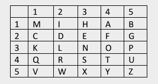
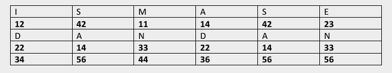

Proiect: Implementarea unui sistem de criptare în Verilog

Scopul temei: Scopul acestei teme este să implementați folosind Verilog un sistem de criptare bazat pe un tabel de substituție și un secret.

Obiective:

Întărirea abilităților de programare hardware: Dezvoltarea abilității de a implementa și testa un algoritm de criptare folosind Verilog, punând accent pe întrelegerea logicii de criptare și a manipulării datelor.

Simularea unui sistem de criptare personalizat: Întrelegerea modului în care un sistem de criptare poate fi personalizat în funcție de parametrii specifici (prenume, nume de familie) și aplicarea acestui concept în Verilog pentru a simula un astfel de sistem.

Testarea și validarea circuitelor digitale: Crearea și utilizarea testbench-urilor pentru a valida corectitudinea design-ului hardware, asigurându-se că procesul de criptare și decriptare funcționează corect pe diverse seturi de date.

Dezvoltarea gândirii algoritmice: Aplicarea unor tehnici de procesare a datelor și calcul matematic pentru a obține rezultate corecte în criptarea și decriptarea mesajelor.

Cerințe:

1. Crearea unui tabel personalizat folosind prenumele:

Se va crea un tabel de substituție de dimensiune 5x5 astfel:

Fiecare student va utiliza literele distincte din prenumele lor pentru a completa primele căsuțe din tabel.

După completarea acestuia, veți adăuga restul literelor din alfabet, excluzând o literă la alegere pentru a se potrivi într-un tabel 5x5 (sunt 26 de caractere în alfabet).

Exemplu pentru MIHAI și litera “J”:

2. Algoritmul de criptare:

Fiecare student va utiliza propriul nume de familie ca secret pentru criptare.

Fiecare literă din mesajul de criptat va fi căutată în tabelul personalizat, punctul 1, pentru a-i obține valoarea.

Se însumează cu valoarea corespunzătoare din cuvântul secret (repetându-l până la lungimea textului).

Exemplu pentru secretul „DAN” și textul clar „ISMASE”:

3. Criptarea și decriptarea:

✅ Implementați atât funcționalitatea de criptare, cât și cea de decriptare. Trebuie să creați două module separate: unul pentru criptare și unul pentru decriptare, fiecare având o intrare de text (sau cipher text) și un cuvânt secret, iar rezultatul va fi un mesaj criptat, respectiv decriptat.

4. Testbench: Trebuie să creați minim 10 testbench-uri (5 pentru criptare, 5 pentru decriptare) care să acopere următoarele scenarii (secretul va fi mereu același):

✅ Criptarea unei singure litere.

✅ Criptarea unui cuvânt.

✅ Criptarea propriului nume de familie.

✅ Criptarea unui mesaj de cel puțin 20 de caractere.

✅ Mesaj cu litere repetate.

5. Criptarea literelor mari și mici:

✅ Adăugați mecanisme pentru a cripta litere mari și mici fără a modifica tabelul personalizat creat la punctul 1. Demonstrați funcționalitatea prin adăugarea de testbench-uri corespunzătoare.

6. Criptarea caracterelor speciale:

Adăugați mecanisme pentru a cripta și caractere speciale (ex. spațiu, “$”, “#”, etc.). Puteți modifica în orice formă doriți codul dvs. Demonstrați funcționalitatea prin adăugarea de testbench-uri corespunzătoare.